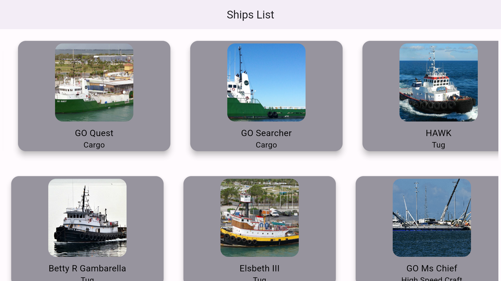

# Sample Flutter TV App
This is a sample project that support Android TV OS App and also it uses Bloc Architecture Pattern with Dio Network Manager and Drift
Database.

NOTE: EXAMPLE ONLY FOR ANDROID

<a title="simulator_image"></a>

## Similar project with (Kotlin Language)
https://github.com/NicosNicolaou16/SampleAndroidTvApp <br />

# References/Tutorials Follow/For Manifest Setup
https://mobikul.com/tv-app-using-flutter/ <br />
https://stackoverflow.com/questions/69607355/how-to-create-stack-vertical-listview-and-horizontal-listview-in-flutter-draggab <br />

# This Project contains:
Android TV OS support <br />
Bloc Architecture Pattern with Repository and Service <br />
Dio (Network Manager) <br />
Drift Database (SQL) <br />

## Versions
Flutter SDK version: 3.19.5 <br />
Dart Version: 3.3.3 <br />

# Setup in Manifest
```xml

<manifest>

    <uses-feature android:name="android.software.leanback" android:required="false" />

    <uses-feature android:name="android.hardware.touchscreen" android:required="false" />

    <application android:banner="@mipmap/ic_launcher">
        <!--other code here-->
        <activity>
            <!--other code here-->
            <intent-filter>
                <action android:name="android.intent.action.MAIN" />

                <category android:name="android.intent.category.LAUNCHER" />
                <category android:name="android.intent.category.LEANBACK_LAUNCHER" />
            </intent-filter>
        </activity>
        <!--other code here-->
    </application>
</manifest>
```

## Check my article
https://medium.com/@nicosnicolaou/android-tv-application-jetpack-compose-and-flutter-f4decfa765c6

# Feeds/Urls/End Point (parsing some data from response)
## (Links References for Ends Points)
https://github.com/r-spacex/SpaceX-API (GitHub) <br />
https://docs.spacexdata.com/?version=latest (Postman) <br />