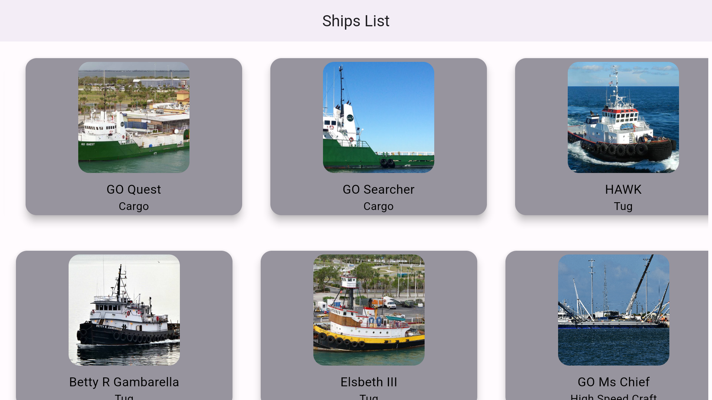

# Sample Flutter TV App

[](https://linktr.ee/nicos_nicolaou)
[](https://nicosnicolaou16.github.io/)
[](https://twitter.com/nicolaou_nicos)
[](https://linkedin.com/in/nicos-nicolaou-a16720aa)
[](https://medium.com/@nicosnicolaou)
[](https://androiddev.social/@nicolaou_nicos)
[](https://bsky.app/profile/nicolaounicos.bsky.social)
[](https://dev.to/nicosnicolaou16)
[](https://www.youtube.com/@nicosnicolaou16)
[](https://g.dev/nicolaou_nicos)

This is a sample project that supports the Android TV OS app. It uses the BLoC architecture pattern, along with Dio for network management and Drift for database handling.

<a title="simulator_image"></a>

> [!IMPORTANT]
> NOTE: EXAMPLE FOR ANDROID ONLY. <br />

> [!IMPORTANT]  
> A detailed step-by-step guide is available on Medium!  
> 👉 **[Android TV Application (Setup for Jetpack Compose and Flutter)](https://medium.com/@nicosnicolaou/android-tv-application-jetpack-compose-and-flutter-f4decfa765c6)** 👈

> [!IMPORTANT]
> A similar project for pure Native Android (Kotlin) is also available!  
> 👉 **[SampleAndroidTvApp](https://github.com/NicosNicolaou16/SampleAndroidTvApp)** 👈

## 🚀 Technologies & Libraries

* **[Android TV OS](https://developer.android.com/tv):** A version of Android designed for smart TVs, providing an optimized interface for streaming and apps.
* **[Bloc Patterns](https://pub.dev/packages/flutter_bloc):** Separates business logic, data access, and UI using streams to handle state. ([Documentation](https://bloclibrary.dev/getting-started/))
* **[Dio Network Manager](https://pub.dev/packages/dio):** Responsible for making requests and retrieving data from remote servers.
* **[Drift Database (SQL)](https://drift.simonbinder.eu/docs/getting-started/):** Handles local data persistence, querying, and offline functionality. ([Documentation](https://pub.dev/packages/drift))
* **[Cached Network Image](https://pub.dev/packages/cached_network_image):** Package for loading images with offline caching support.

## 🔧 Setup

### Manifest Configuration
To support Android TV, update your `AndroidManifest.xml` with the following:

```xml

<manifest>

    <uses-feature android:name="android.software.leanback" android:required="false" />

    <uses-feature android:name="android.hardware.touchscreen" android:required="false" />

    <application android:banner="@mipmap/ic_launcher">
        <!--other code here-->
        <activity>
            <!--other code here-->
            <intent-filter>
                <action android:name="android.intent.action.MAIN" />

                <category android:name="android.intent.category.LAUNCHER" />
                <category android:name="android.intent.category.LEANBACK_LAUNCHER" />
            </intent-filter>
        </activity>
        <!--other code here-->
    </application>
</manifest>
```

> [!IMPORTANT]  
> Check my article for the setup :point_right: [Android TV Application (Setup for Jetpack Compose and Flutter) - Medium](https://medium.com/@nicosnicolaou/android-tv-application-jetpack-compose-and-flutter-f4decfa765c6) :point_left: <br />

> [!IMPORTANT]
> Similar project with (Kotlin Language) :point_right: [SampleAndroidTvApp](https://github.com/NicosNicolaou16/SampleAndroidTvApp) :point_left: <br />

## 📊 Versioning

- **Flutter SDK:** **3.41.6**
- **Dart Version:** **3.11.4**

## 🌐 API & Data Sources

- **SpaceX-API (GitHub):** [r-spacex/SpaceX-API](https://github.com/r-spacex/SpaceX-API)
- **Postman Documentation:** [SpaceX Data API](https://docs.spacexdata.com/?version=latest)

## 📚 References

- **TV App Guide:** [TV App using Flutter - Mobikul](https://mobikul.com/tv-app-using-flutter/)
- **UI Layouts:** [Stack, Vertical, and Horizontal ListView in Flutter](https://stackoverflow.com/questions/69607355/how-to-create-stack-vertical-listview-and-horizontal-listview-in-flutter-draggab)

## ⭐ Stargazers

If you find this project useful, please give it a star!
[Check out the stargazers here](https://github.com/NicosNicolaou16/SampleFlutterTVApp/stargazers)

## 🙏 Support & Contributions

This project is maintained for the community. Feedback, bug reports, and feature requests are welcome! Feel free to **open an issue** or submit a **pull request**.